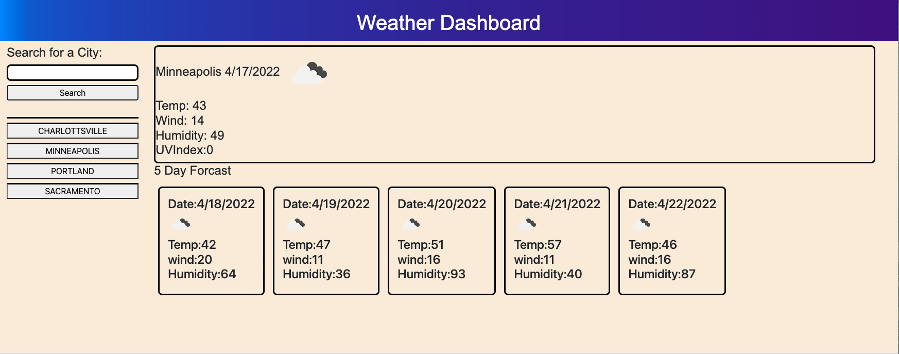

# Weather-dashboard
written by: Christopher Borer April 14th 2022.

summary:
This program will shhow the weather outlook for multiple cities based on a current and past searches.

Criteria:
1. Enter a City Name and submit will show current weather and a 5 day forecast.
2. it will verify that the city name is acceptable to the api.
3. If it is not a valid city it will ask for a valid city
4. Each search will be stored and will then appear in a past searches results to as a button to submit for an update weather report.

github link to the final version of code.
This site was built using [GitHub Pages](https://github.com/cspower5/Weather-dashboard).

